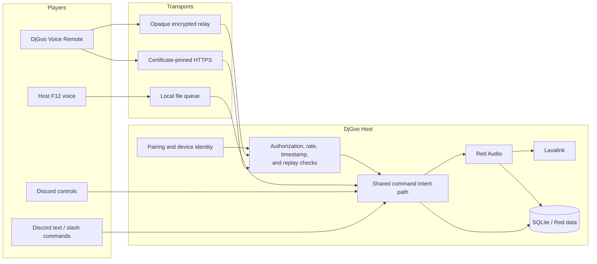
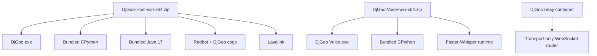

# DjGoo architecture

DjGoo is a game-first control layer around Red-DiscordBot Audio. It deliberately keeps one playback authority and treats voice, chat, buttons, local recognition, and remote clients as command inputs to that authority.

## System overview



The direct and relay transports terminate at the same Host-side command processor. Neither transport owns playback, queue state, permissions, radio state, or requester identity.

## Portable products



Large Whisper model files are downloaded into mutable `data/models/` rather than duplicated in every release ZIP.

## Components

### Host launcher

`DjGoo.exe` is the only user-facing process in the portable Host package. It validates the package layout, starts and stops the supervisor, opens setup and diagnostics, and never stores Discord credentials itself.

### Supervisor

The supervisor owns process lifecycle for Lavalink, Redbot, and the local voice listener. Component identity is validated with process ID, process creation time, command-line markers, and fresh health records. A failed component is restarted independently.

The source checkout uses `tools/djgoo_stack.py`. Portable releases retain that file as `djgoo_stack_core.py` and place the explicit runtime adapter at `djgoo_stack.py`.

### Playback authority

Red Audio and Lavalink are the only playback and queue authority. DjGoo adapters call supported Red commands or APIs rather than maintaining a second player.

### Command inputs

All command sources produce the same structured command envelope:

- Discord text and slash commands;
- Discord buttons;
- local F12 voice recognition;
- direct paired Voice Remote clients;
- encrypted-relay Voice Remote clients.

Command sources do not mutate playback state directly.

### Pairing and requester identity

The Host creates short-lived, one-time pairing codes and stores them as keyed hashes. A successfully paired device receives a random credential bound to one Discord user and guild. Device tokens are also stored only as keyed hashes and are individually revocable.

Every remote command is resolved back to the paired Discord member before Red Audio creates the command context. The Host verifies live voice-channel state again at execution time rather than trusting only the original network envelope.

### Direct transport

The direct Voice Gateway is an HTTPS service on the Host. Voice Remote pins the Host certificate fingerprint during pairing. This mode is intended for a trusted LAN or authenticated private overlay.

### Outbound encrypted relay

The optional relay allows Host and Voice Remote to make outbound WSS connections. Payloads are encrypted end to end with ephemeral X25519 key exchange, HKDF-SHA256, and ChaCha20-Poly1305. Host room registration is signed with Ed25519.

The relay sees routing identifiers, timing, connection metadata, and ciphertext. It cannot authorize commands, create pairing/device records, or become playback authority. A malicious relay can still delay, drop, reorder, or refuse traffic; Host-side timestamps and command UUID receipts prevent stale or duplicated playback actions.

### Persistent data

Portable packages keep mutable state beside the application:

```text
config/  user-editable configuration and secrets
data/    Red data, radio memory, credentials, keys, models, and health state
logs/    operational logs
```

The remaining application and runtime files are replaceable during an upgrade. Rollback consists of replacing application/runtime files while retaining a compatible backup of `config/` and `data/`.

## Distribution

Windows releases are assembled on clean GitHub Actions runners. The release workflow:

1. runs compilation and the complete test suite;
2. downloads the verified CPython 3.11 embeddable runtime;
3. installs compatible Windows dependencies into isolated runtimes;
4. bundles Temurin Java and the Red-compatible Lavalink jar with Host only;
5. builds the graphical launchers with PyInstaller;
6. optionally Authenticode-signs executables and requires signing for stable tags;
7. rejects PowerShell and VBS files from public layouts;
8. writes per-file SHA-256 manifests and CycloneDX SBOMs;
9. smoke-tests imports, executables, and first-run initialization;
10. publishes ZIPs and checksums together;
11. creates public build-provenance attestations after repository visibility permits them.

The relay workflow separately tests cryptography and complete encrypted round trips, builds an unprivileged container, verifies read-only/no-capability execution, and can publish a provenance- and SBOM-enabled GHCR image.

## Design constraints

- One logical playback leader per Discord guild.
- The Discord bot token never leaves the Host.
- Voice recognition runs locally by default.
- Raw microphone audio is not accepted by command transports.
- Remote commands are authenticated, attributed, permission-checked, rate-limited, timestamp-checked, and idempotent.
- Direct and relay transports share the same authorization and queue processor.
- The relay is transport only and must not become playback authority.
- A transport outage must not stop local playback or unrelated transports.
- Runtime dependencies remain replaceable and visible; DjGoo is not an opaque monolithic binary.
